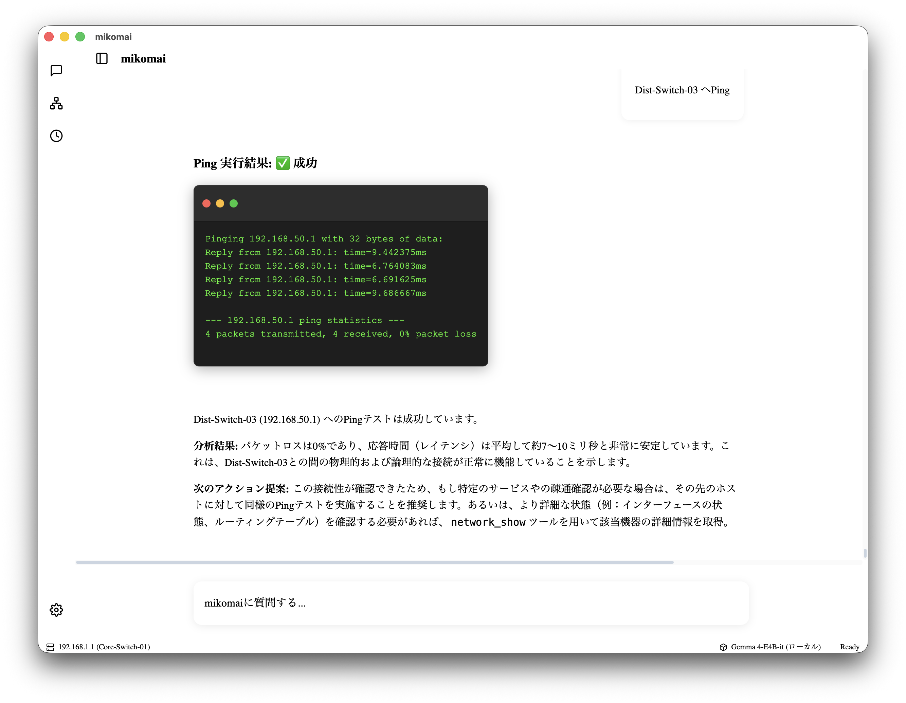

<p align="center"></p>

  

# mikomai - ネットワークAIアシスタントツール
### Managed Infrastructure Knowledge Operator of Ml Agent Interface



ネットワーク機器の診断および技術文書の参照を支援するAIアシスタント。ローカルLLMとRAG（検索拡張生成）を統合したデスクトップアプリケーションです。

## 機能
- **推論エンジン**: ローカル環境のGPU（Metal等）を使用した低遅延な推論。
- **ネットワーク診断**: MCP（Model Context Protocol）によるツールの自動実行（Ping, Traceroute, ARP, IP情報取得等）。
- **ドキュメント検索**: 独自ナレッジベース（NW-DB）を対象としたRAG機能。
- **管理機能**: セッション履歴の自動要約、およびネットワーク接続ホスト管理。

## 技術構成
- **Core**: Tauri / Rust
- **Frontend**: React / TypeScript
- **Inference**: Llama.cpp
- **Storage**: LanceDB (Vector Store)

## セットアップ

### 依存関係のインストール
```bash
npm install
```

### 開発サーバーの起動
```bash
npm run tauri dev
```

### ビルド
```bash
npm run tauri build
```

## ライセンス
[LICENSE.md](LICENSE.md) を参照してください。
