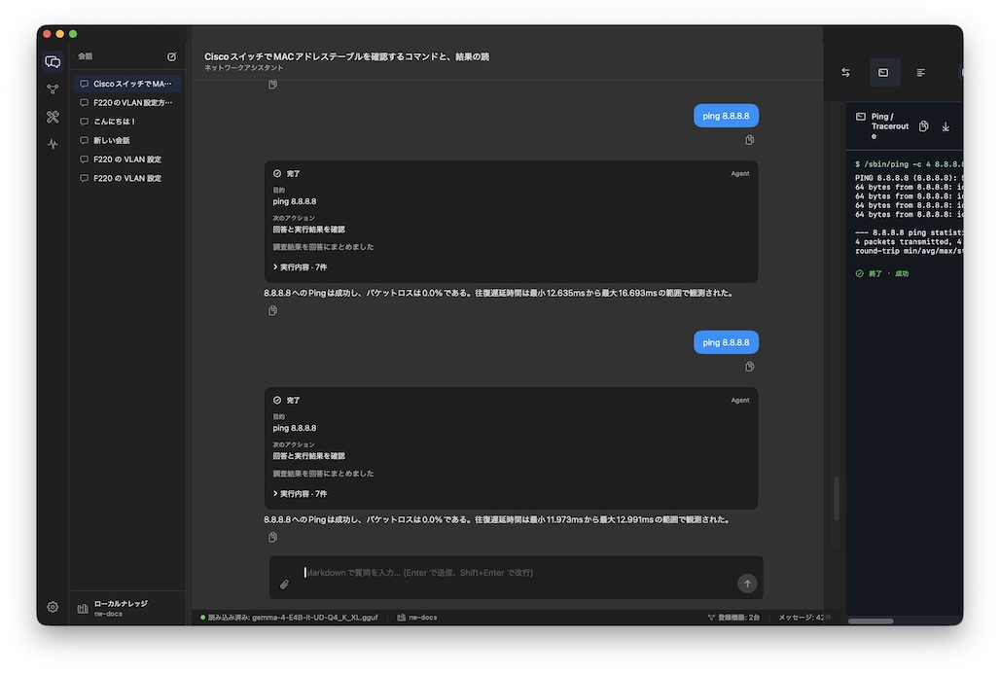
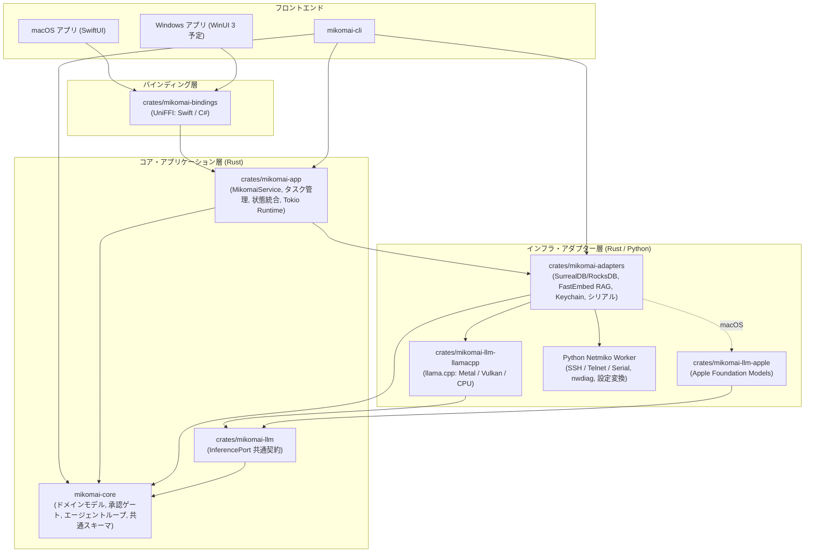

# MIKOMAI
**Model-driven Intent Kernel for Orchestrating Multi-vendor Autonomous Infrastructure**


<p align="center">
  
</p>

<p align="center">
  
</p>

### LLM-Native Intent Kernel for Network Operating Systems

Mikomaiは、ネットワーク機器の操作をより直感的に、かつ安全に行うための Network Intent Kernel (LLMハーネス) です。

## 主な特徴
ネットワークエンジニアが日々のルーティンワークを、より直感的に、かつ安全に行えるようにすることを支援することを目指しています。

- エージェントによる自律的なネットワーク調査や操作
- ping/traceroute/telnet/ssh/シリアル接続などのコマンドを自動で実行し、収集した情報を整理する
- 複雑なネットワーク構成図を自動的に生成・表示する
- 不要なテレメトリや学習規約は一切実装無し。AIを活用できます。

これらをフロンティアモデル/SOTAのLLMではなく、**軽量なローカルLLM(Google Gemma 4 E4B や Apple Foundation Models など)を活用し、高速、かつ安心に作業できる**ことを目指して、開発しています。

---

## システムアーキテクチャ

UI 以外のロジックはすべて Rust で共有し、UniFFI 経由でネイティブ UI（macOS: SwiftUI / Windows: WinUI 3）および CLI から利用します。


```mermaid
flowchart TD
  subgraph UI ["フロントエンド"]
    SwiftUI["macOS アプリ (SwiftUI)"]
    WinUI["Windows アプリ (WinUI 3 予定)"]
    CLI["mikomai-cli"]
  end

  subgraph Bindings ["バインディング層"]
    UniFFI["crates/mikomai-bindings<br/>(UniFFI: Swift / C#)"]
  end

  subgraph CoreLayer ["コア・アプリケーション層 (Rust)"]
    App["crates/mikomai-app<br/>(MikomaiService, タスク管理, 状態統合, Tokio Runtime)"]
    Core["mikomai-core<br/>(ドメインモデル, 承認ゲート, エージェントループ, 共通スキーマ)"]
    LLMContract["crates/mikomai-llm<br/>(InferencePort 共通契約)"]
  end

  subgraph Adapters ["インフラ・アダプター層 (Rust / Python)"]
    AdaptersCrate["crates/mikomai-adapters<br/>(SurrealDB/RocksDB, FastEmbed RAG, Keychain, シリアル)"]
    LlamaBackend["crates/mikomai-llm-llamacpp<br/>(llama.cpp: Metal / Vulkan / CPU)"]
    AppleBackend["crates/mikomai-llm-apple<br/>(Apple Foundation Models)"]
    Worker["Python Netmiko Worker<br/>(SSH / Telnet / Serial, nwdiag, 設定変換)"]
  end

  SwiftUI --> UniFFI
  WinUI --> UniFFI
  UniFFI --> App
  CLI --> App
  CLI --> AdaptersCrate
  CLI --> Core
  App --> Core
  App --> AdaptersCrate
  AdaptersCrate --> Core
  AdaptersCrate --> LlamaBackend
  AdaptersCrate -.->|macOS| AppleBackend
  AdaptersCrate --> Worker
  LlamaBackend --> LLMContract
  AppleBackend --> LLMContract
  LLMContract --> Core
```

---

## 主な特徴

| 機能 | 内容 |
| --- | --- |
| **日本語対話 & RAG 検索** | 技術ドキュメント（`nw-docs/` 等）を FastEmbed (E5) でベクトル化し、SurrealDB を通じて高精度な文脈付き回答を提供。 |
| **自律エージェント診断** | Ping、経路・ARP テーブル調査、機器設定取得、パケット解析などを自動で複数ステップ実行し、障害原因を究明。 |
| **安全な変更承認ゲート** | 設定投入やファイル転送などの変更操作は、SHA-256 ハッシュ付きの変更計画（`OperationPlan`）を作成。ユーザー承認なしには 1 バイトも送信しません。 |
| **ローカル推論 (GGUF / Apple FM)** | llama.cpp（GGUF、Metal / Vulkan / CPU）および Apple Foundation Models に対応。画像対応モデル（Gemma 4 mmproj）によるトポロジ図解析もサポート。 |
| **構成図の自動生成** | 自然言語や会話履歴から nwdiag DSL を自動生成し、SVG 形式のネットワーク構成図をチャット内に表示・保存。 |
| **機密情報の保護** | ログインパスワードや Enable パスワードは OS Keychain / Credential Manager に暗号化保存。LLM プロンプトやログへの流出を自動遮断。 |

### コア・アーキテクチャの強み

ベンダーや機器固有の実装差分を吸収し、安全性・透明性の高いネットワーク自動化を実現するための核となるアプローチです。

- **共通状態モデル（Canonical State Model）による抽象化**  
  ベンダーや機器ごとの CLI・データ構造の差異を統一モデルへ抽象化。  
  状態取得、構成変更、差分検出（Diff）、実行結果の検証を一貫したインターフェースで提供します。

- **決定論的制御 × 軽量ローカルLLM のハイブリッド**  
  自然言語の柔軟な意図理解には軽量ローカル LLM を用い、機器の操作や状態遷移は決定論的な制御ロジックが担当。  
  限られたローカル計算資源でも、透明性・安全性・拡張性かつ高速で動作する自動化基盤を実現します。

- **完全ローカル環境でプライバシーを確保**  
  外部クラウドに依存せず、Mac (Metal) / Windows (Vulkan / CPU) 上で完全に自己完結。  
  構成情報や認証情報が外部へ漏洩しない安全な実行環境を提供します。

上記のアーキテクチャにより、**ネットワークエンジニアのルーティンワークの8割を、いつもの2割の労力で。** をモットーに、開発しています。

---

## ディレクトリ構成

| ディレクトリ | 役割 | README |
| --- | --- | --- |
| [`mikomai-core/`](file:///Users/kamera25/mikomai/mikomai-core) | OS・UI・I/O に依存しない純粋なドメイン層 | [詳細](file:///Users/kamera25/mikomai/mikomai-core/README.md) |
| [`crates/`](file:///Users/kamera25/mikomai/crates) | アプリケーション、アダプター、UniFFI、CLI、LLM 実装 | [詳細](file:///Users/kamera25/mikomai/crates/README.md) |
| [`mikomai-desktop-mac/`](file:///Users/kamera25/mikomai/mikomai-desktop-mac) | macOS 向け SwiftUI デスクトップアプリケーション | [詳細](file:///Users/kamera25/mikomai/mikomai-desktop-mac/README.md) |
| [`mikomai-core/assets/`](file:///Users/kamera25/mikomai/mikomai-core/assets) | Netmiko ワーカー、設定変換、nwdiag 描画等の Python アセット | [詳細](file:///Users/kamera25/mikomai/mikomai-core/assets/README.md) |
| [`nw-docs/`](file:///Users/kamera25/mikomai/nw-docs) | ネットワーク機器の技術資料（Markdown / テキスト） | - |

---

## クイックスタート

### 1. 開発環境の準備
- **Rust**: 1.80 以上 (stable)
- **macOS SDK & Swift Toolchain**: Xcode または Command Line Tools
- **Node.js**: npm (CLI 呼び出し用ラッパー)

### 2. macOS デスクトップアプリの起動
リポジトリルートで実行します：
```bash
./mikomai-desktop-mac/run.sh
```

配布用 `.app` バンドルを生成する場合：
```bash
./mikomai-desktop-mac/build-app.sh
```

### 3. CLI の利用
CLI は Rust ワークスペースから直接実行可能です：
```bash
# ヘルプの表示
npm run cli -- --help

# チャット応答（技術ドキュメントに基づく回答）
npm run cli -- chat "FITELnet F220 の VLAN 設定方法を教えて"

# 技術資料のベクトル検索
npm run cli -- rag-search "VLAN"

# ドキュメントの新規取り込み
npm run cli -- rag-ingest nw-docs
```

---

## 検証とテスト

```bash
# Rust ワークスペース全体の型チェック
cargo check --workspace

# Rust 単体・結合テスト
cargo test -p mikomai-core -p mikomai-app -p mikomai-adapters -p mikomai-bindings -p mikomai-cli

# Swift デスクトップアプリのテスト
./mikomai-desktop-mac/test-core.sh

# CLI 動作検証（デバッグ JSONL 出力）
npm run --silent cli -- chat "F220のVLAN設定方法を教えて" --debug-jsonl
```

---

## キャッシュとクリーンアップ

ビルド生成物や一時キャッシュを整理するには `clean.sh` を使用します：

```bash
./clean.sh
```

- `-n`: 削除対象と推定容量のプレビュー表示（削除は実行しません）。
- `-y`: 確認プロンプトをスキップして即時削除。
- `-d`: `node_modules`、`venv`、`.fastembed_cache` を含むディープクリーンアップ。

---

## ライセンス

本プロジェクトは [LICENSE.md](LICENSE.md) に基づき公開されています。
