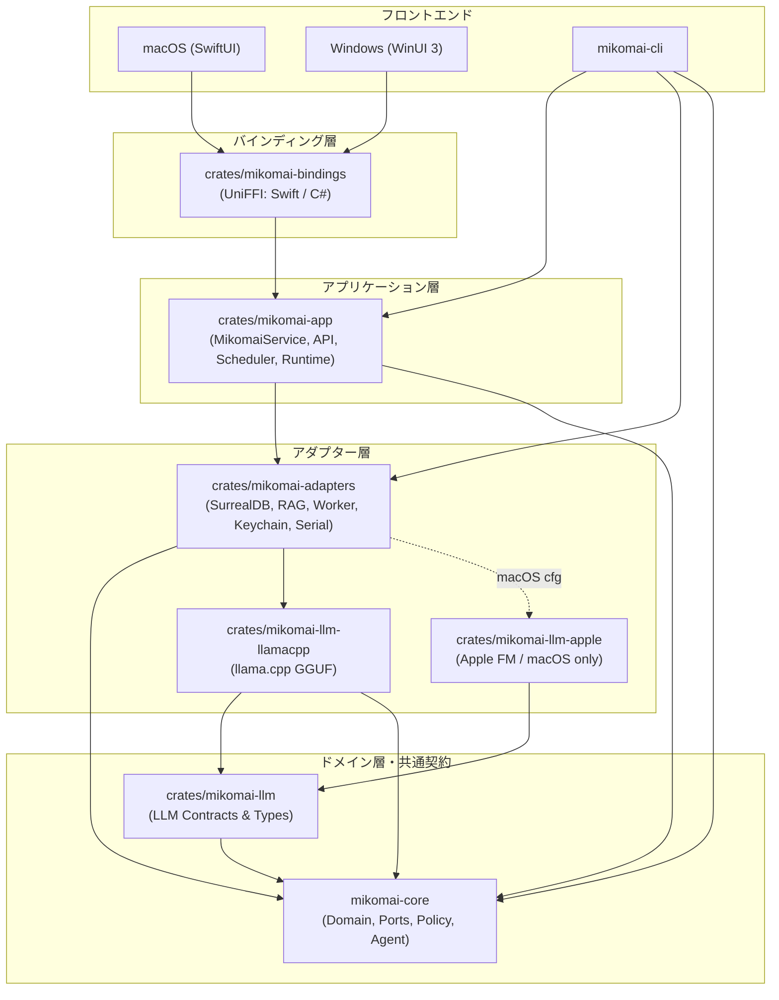

# Mikomai workspace crates

Mikomai はオニオンアーキテクチャを採用しており、リポジトリ直下のドメイン層 [`mikomai-core`](file:///Users/kamera25/mikomai/mikomai-core) を中心に、外側のアダプター層・アプリケーション層・バインディング層が内向きに依存する構造をとっています。`core` は OS 固有 UI、DB、LLM 実装、外部プロセス等の I/O を参照しません。

## Crate 構成と役割



| Crate | パス | 役割と責務 |
| --- | --- | --- |
| [`mikomai-core`](file:///Users/kamera25/mikomai/mikomai-core) | `mikomai-core/` | ドメインロジック、ポリシー、自律エージェント、ポート定義（`InferencePort`、`SearchPort`、`ReporterPort` 等）。I/O や具象インフラに依存しない。 |
| [`mikomai-llm`](file:///Users/kamera25/mikomai/crates/mikomai-llm) | `crates/mikomai-llm/` | LLM 推論契約の共通インターフェース。core の `InferencePort`、`StreamingInferencePort`、`VisionPort`、`InferenceCapabilities`、`ModelAvailability` などを再公開。 |
| [`mikomai-llm-llamacpp`](file:///Users/kamera25/mikomai/crates/mikomai-llm-llamacpp) | `crates/mikomai-llm-llamacpp/` | `llama.cpp`（GGUF）による推論バックエンド。マルチスレッド、Metal / Vulkan / CPU 推論、ストリーミング、Vision、推論キャンセル制御を担当。 |
| [`mikomai-llm-apple`](file:///Users/kamera25/mikomai/crates/mikomai-llm-apple) | `crates/mikomai-llm-apple/` | macOS 専用 Apple Foundation Models（`/usr/bin/fm` CLI）推論バックエンド。非 macOS の `--workspace` ビルドを阻害しないよう workspace member から除外（`exclude`）され、macOS target 依存でのみビルド。 |
| [`mikomai-adapters`](file:///Users/kamera25/mikomai/crates/mikomai-adapters) | `crates/mikomai-adapters/` | インフラストラクチャアダプター。SurrealDB（RocksDB 組み込み）による永続化・グラフDB、FastEmbed（E5）による RAG、Python Netmiko ワーカープロセス連携、OS 資格情報（`keyring`）、シリアルポート制御、監査ログ、ルーター状態正規化など。 |
| [`mikomai-app`](file:///Users/kamera25/mikomai/crates/mikomai-app) | `crates/mikomai-app/` | アプリケーションオーケストレーション。`MikomaiService` がアプリ全体の状態（セッション、タスク、承認計画、排他制御等）と単一 Tokio Runtime を所有。`api` モジュール（`Command` / `Query` / `TaskEvent` / `Snapshot`）および所有型ブリッジを提供。 |
| [`mikomai-bindings`](file:///Users/kamera25/mikomai/crates/mikomai-bindings) | `crates/mikomai-bindings/` | UniFFI によるネイティブ UI 向けバインディング。旧手書き C ABI（`mikomai-ffi`）を置き換え、1 つの定義から Swift / C# 向けの型安全な FFI コードを生成（`uniffi-bindgen` / `uniffi-bindgen-cs`）。 |
| [`mikomai-cli`](file:///Users/kamera25/mikomai/crates/mikomai-cli) | `crates/mikomai-cli/` | コマンドラインツール。`chat`、`serve` などのサブコマンドを提供。`mikomai-app` や `mikomai-adapters` に直接依存し、`--debug-jsonl` による詳細トレース出力に対応。 |

---

## LLM 推論バックエンド境界

LLM バックエンドは `mikomai-llm`（core の `InferencePort`）を実装することでプラガブルに切り替え可能です。

- `capabilities()`: テキスト生成、構造化出力、tool calling、トークン制限（入力／出力制限）を返します。
- `availability()`: コンパイル時ではなく実行時の状態を返します（GGUF ファイルのロード状況や、Apple FM の `fm available` 状態）。

### Apple Foundation Models の利用例
macOS アプリケーション側で選択可能です（CLI や既定の構成は llama.cpp を標準利用）:

```rust,ignore
use mikomai_llm::InferencePort;
use mikomai_adapters::apple::AppleInference;

let backend = AppleInference::default();
let capabilities = backend.capabilities();
let availability = backend.availability();
let answer = backend.complete("短く挨拶してください").await?;
```

- `/usr/bin/fm`（`available`, `count-tokens --quiet`, `respond --no-stream`）を使用。
- CLI 不在やモデル準備未完了時は実行時に unavailable を返し、同意画面の表示やインストールは自動実行しません。
- プロンプトは標準入力経由で渡され、シェル展開の影響を受けません。
- トークン予算（入力上限 3072、応答用余裕 1024）を保守的に管理します。

---

## ビルドと検証

### ワークスペース全体の整合性チェック
```bash
cargo check --workspace
```

### 主要クレートの単体テスト
```bash
cargo test -p mikomai-core -p mikomai-app -p mikomai-adapters -p mikomai-bindings -p mikomai-cli
```

### Apple バックエンドの個別検証（macOS のみ）
```bash
cargo test --manifest-path crates/mikomai-llm-apple/Cargo.toml --target-dir target
cargo run --manifest-path crates/mikomai-llm-apple/Cargo.toml --target-dir target --example smoke
```

### CLI 動作検証（必須検証ステップ）
```bash
npm run --silent cli -- chat "F220のVLAN設定方法を教えて" --debug-jsonl
```
