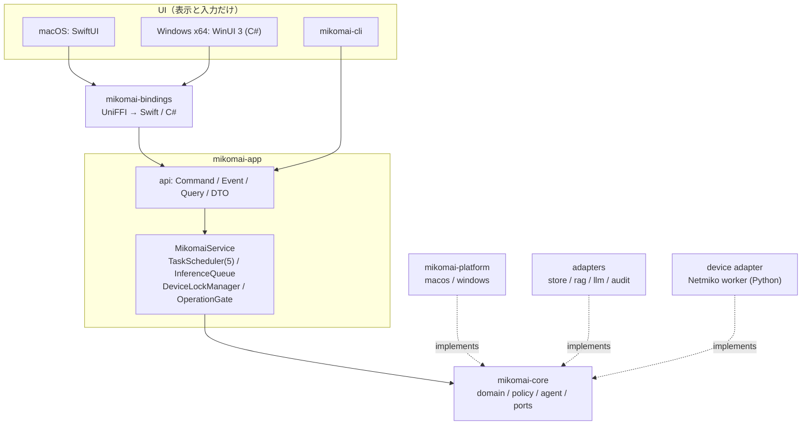

# Mikomai を一から作る場合の再設計案（改訂 v4・方針確定版）

> [!NOTE]
> v3 へのコメントを反映し、未決事項がなくなった版です。コードは変更していません。
> 旧 [refactoring-plan.md §12–13](file:///Users/kamera25/mikomai/doc/refactoring-plan.md#L277-L417) は Tauri 前提のため、この案で置き換える想定です。

## 0. 決定事項

| 項目 | 決定 | 設計への影響 |
| --- | --- | --- |
| 言語間の接続（ブリッジ） | **UniFFI + uniffi-bindgen-cs** | 1 つの定義から Swift と C# の両方を生成する。ブリッジ crate は 1 つで済む（§3） |
| 対象 | **macOS arm64（SwiftUI）+ Windows x64（WinUI 3）の 2 つのみ**。macOS Intel・Windows ARM64・Windows 32bit は対象外 | UI 以外のロジックはすべて Rust に置く。ビルドの組合せは 2 通りだけ（§10） |
| 機器への接続 | **Netmiko を維持**（SSH / Telnet / console） | Python ワーカーを正式なアダプターとして設計し直す（§4） |
| Cisco 変換・nwdiag | **ワーカーに同梱** | Rust への移植はしない。旧 §13 の「Python 処理を Rust で再実装」は取り消す |
| Windows の推論 | **llama.cpp Vulkan を標準**とし、使えない場合は CPU に切り替える。CUDA は任意の追加ビルド | 標準の配布物は 1 種類（§10） |
| 同時タスク数 | 約 5 | タスクスケジューラと推論キューを分ける（§5） |
| 機器単位の排他制御 | **こちらで決定**（§5.3） | 機器ごとに「読み取りは共有、変更は排他」。シリアルポートは常に排他 |
| 旧データ | **全削除** | 移行・取込コードは作らない |
| 接続情報の CSV/JSON import | **残さない** | 取込機能そのものを廃止する |

## 1. 現状の主な問題

| # | 確認したこと | 対応 |
| --- | --- | --- |
| P1 | [mikomai-ffi/lib.rs](file:///Users/kamera25/mikomai/crates/mikomai-ffi/src/lib.rs) が 5,576 行・`extern "C"` が 78 個あり、アプリ層の処理を抱え込んでいる | `mikomai-app` に移す |
| P2 | static な `OnceLock<Mutex<…>>` が多数あり、Runtime が 2 つある。承認待ちの計画はメモリ上にしかない | Service が状態を持ち、承認待ちは保存する |
| P3 | CLI が `mikomai-ffi` に依存している | CLI は app に直接依存させる |
| P4 | 会話セッション・接続情報・機器種別・承認の流れが Swift にある（[NativeFeatureLogic.swift](file:///Users/kamera25/mikomai/mikomai-desktop-mac/Sources/MikomaiDesktopCore/NativeFeatureLogic.swift), [OperationWorkflow.swift](file:///Users/kamera25/mikomai/mikomai-desktop-mac/Sources/MikomaiDesktopCore/OperationWorkflow.swift), [DeviceTypeCatalog.swift](file:///Users/kamera25/mikomai/mikomai-desktop-mac/Sources/MikomaiDesktopCore/DeviceTypeCatalog.swift), [ModelPresetCatalog.swift](file:///Users/kamera25/mikomai/mikomai-desktop-mac/Sources/MikomaiDesktopCore/ModelPresetCatalog.swift)） | Rust に移す（C# で書き直すのを避ける） |
| P5 | NDP・経路の取得を Swift から `ndp`/`netstat` を起動して行っている | Rust の `HostNetworkPort` を OS ごとに実装する |
| P6 | Netmiko と Keychain を Swift の callback 経由で呼んでいる。Netmiko は macOS arm64 用のバイナリのみ | Rust から直接ワーカーを管理する。Windows x64 用のバイナリを追加する |
| P7 | 保存先が分散している | SurrealDB の 1 系統にまとめ直す |

## 2. 目標アーキテクチャ



## 3. ブリッジ（UniFFI + uniffi-bindgen-cs）

- `mikomai-bindings` crate を 1 つ作り、UniFFI の proc-macro で `MikomaiService` を公開する。Swift 用は `uniffi-bindgen`、C# 用は `uniffi-bindgen-cs` で生成する。
- **バージョン固定**: uniffi-bindgen-cs は特定の UniFFI バージョンに追従する外部プロジェクトなので、**UniFFI 本体のバージョンは bindgen-cs が対応するものに合わせて固定する**。
- **C# 側の機能差に備える**: 公開 API は次の形に限定し、言語ごとの機能差の影響を受けにくくする。
  - 呼び出し: `submit(Command) -> TaskId`、`query(Query) -> Snapshot`、`cancel(TaskId)`。すぐ返る同期関数にし、重い処理は Rust 内部の Runtime で実行する。
  - 通知: `subscribe(EventListener)`。UniFFI の callback interface を使い、`TaskEvent` を受け取る。
  - Rust の async 関数をそのまま公開することには依存しない（bindgen-cs の async 対応状況を導入時に確認する）。
- **OS 側に残す callback は最小限にする**: 通知の表示とファイル選択ダイアログだけを UI 側で担当し、秘密情報（資格情報）は Rust の `keyring` で扱う。
- **契約テスト**: 同じシナリオ fixture を使い、Swift テスト・C# テスト・CLI の 3 つで、得られる `TaskEvent` の列が一致することを CI で確認する。

## 4. 機器への接続: Netmiko ワーカーを正式なアダプターにする

Telnet と console（シリアル）が必要なので、**Netmiko を維持する判断は妥当**です。Netmiko は `*_telnet` / `*_serial` の device_type に対応しています。Rust ネイティブ実装への置き換えはやめ、Netmiko を `DeviceExecPort` の正式な実装として作り直します。

| 観点 | 設計 |
| --- | --- |
| 配布 | PyInstaller で単一バイナリにする: `mikomai-device-worker-macos-arm64` と `-windows-x64.exe`。Python 本体のインストールは不要 |
| 起動 | Rust がワーカーを常駐プロセスとして起動・監視し、異常終了したら再起動する。カレントディレクトリや venv を探索しない |
| 通信 | 標準入出力で JSON を 1 行ずつやり取りする（`id`, `op`, `transport: ssh/telnet/serial`, `device_type`, `timeout`）。プロトコルにバージョンを持たせる |
| 資格情報 | Rust が `keyring` から取り出し、**標準入力の要求本文でだけ**渡す。コマンドライン引数・環境変数・ログには出さない。ワーカーの出力は Rust 側で秘密情報を除去してから記録する |
| タイムアウト / キャンセル | 要求ごとに期限を設ける。キャンセル時はまず中断を要求し、期限を過ぎたらプロセスを強制終了する。**変更操作の送信後にこれが起きた場合は `Unknown` として扱う** |
| セッション | 機器ごとにセッションを再利用するかはワーカー内で管理する。排他制御は Rust の `DeviceLockManager` が決める（§5.3） |
| シリアル | macOS は `/dev/cu.*`、Windows は `COMn` を `HostNetworkPort` で列挙する。ワーカーは pyserial で開く |
| 同じバイナリに入れる処理 | Cisco の設定検証・変換、nwdiag。Python を配布することは変わらないので、まずは同じバイナリに入れる |

> [!NOTE]
> **決定**: Cisco 変換・nwdiag はワーカーに同梱します。テンプレート（`arista.j2`, `juniper.j2`）と nwdiag の描画に必要なフォントもバイナリに含めます。OS のフォントには依存させないので、Windows でも日本語ラベルが文字化けしません。ワーカーのプロトコルでは、Netmiko の操作と同じ形式で `op: config_validate / config_convert / nwdiag_render` として呼び出します。

## 5. 同時実行と排他制御

### 5.1 TaskScheduler（同時 5 タスク）
- `Semaphore(5)`（設定で変更可）。超えた分は `Queued` にする。
- 状態: `Queued → Running → {AwaitingUser | AwaitingApproval | WaitingDevice} → Completed | Failed | Cancelled`
- 人の応答待ち（`AwaitingUser` / `AwaitingApproval`）の間は実行枠を解放する。

### 5.2 InferenceQueue
- ローカル LLM の推論は 1 本ずつ処理する。優先度は、対話中の最終回答 > Planner > Watch の順。
- キャンセルは、順番待ちの推論と実行中の推論の両方に効くようにする。

### 5.3 機器単位の排他制御（方針案）

| 規則 | 内容 | 理由 |
| --- | --- | --- |
| R1 機器ごとの読み書きロック | 読み取り（show/fetch/ping など）は同時に実行してよい。変更（config/console 送信/転送/rollback）は排他にする。変更を待っている間は、新しい読み取りも待たせる | 変更途中の状態を観測しないため。読み取りがずっと続いて変更が進まない状態も防ぐ |
| R2 シリアルポートは常に排他 | `serial` の接続は、読み取りか変更かに関係なく、ポートごとに 1 本だけ | OS の制約上、同じポートを同時に開けないため |
| R3 機器の識別 | 登録機器 ID を正とする。未登録の場合は、名前を解決した IP と port で識別する | 名前と IP で別々にロックを取ってしまうのを防ぐ（agent-architecture の重複判定と同じ規則） |
| R4 待ち方 | ロックを待つ間は `WaitingDevice` として UI に表示し、待機中も実行枠を解放する。読み取りは 60 秒、変更は 5 分（設定で変更可）を過ぎたら `AwaitingUser` にして、続けるか中止するかを聞く | 自動で失敗にも再試行にもしない |
| R5 Watch | 変更でロック中の機器は、その回の実行を見送り、見送ったことを記録する | 定期実行が変更操作を邪魔しないようにする |
| R6 プロセスをまたぐ排他 | 機器 ID ごとに、データディレクトリ内のロックファイルで OS のファイルロック（advisory lock）をかける。これは変更操作とシリアル接続だけに適用する | GUI と CLI を同時に起動しても、同じ機器に二重で変更が入らないようにする |
| R7 記録 | ロックの取得・待ち時間・タイムアウトを監査ログに記録する | 運用しながら規則を調整できるようにする |

- 実装: `DeviceLockManager` を `OperationGate` と読み取りツールの実行の手前に置く。ロックは「承認を確認した後、Executing へ遷移する前」に取る。ロックを取れないまま送信することはない。
- デッドロックを避けるため、1 つのタスクが同時に持てる変更ロックは 1 機器分までにする。複数機器を変更する計画は、機器ごとに順番に実行する。

### 5.4 イベント
`TaskEvent { task_id, seq, version, kind }`。取りこぼしがあれば `query(TaskSnapshot)` で取り直し、重複した `seq` は無視する。

## 6. データ（旧データと取込機能は削除）

- **削除するもの**: 旧 `watches.json` の読込、旧 task event JSON の取込、旧 settings の import、**接続情報の CSV/JSON import**。
- 保存先は SurrealDB の 1 系統: settings / connections / sessions / tasks / operations / approvals / watches / audit / rag_chunk / graph。正本となるテーブルには `schema_version` を持たせる。
- 接続情報は、UI から 1 件ずつ登録・編集する方法だけにする。資格情報は OS の資格情報ストア（macOS は Keychain、Windows は Credential Manager）に保存し、DB には参照 ID だけを持つ。
- 旧ディレクトリが見つかったら、削除するかどうかを案内するだけにする（自動では削除しない）。

## 7. OS ごとの差の吸収

| Port | macOS (arm64) | Windows x64 |
| --- | --- | --- |
| `SecretsPort` | Keychain（`keyring`） | Credential Manager（`keyring`） |
| `HostNetworkPort` | sysctl またはコマンド実行 | `GetIpNetTable2` / `GetIpForwardTable2` |
| `DeviceExecPort` | Netmiko ワーカー（arm64） | Netmiko ワーカー（x64） |
| `InferencePort` | llama.cpp Metal / Apple FM | llama.cpp **Vulkan + CPU 退避**（CUDA は任意のビルド） |
| `PathsPort` | Application Support | `%APPDATA%` |

## 8. crate / ディレクトリ構成

```text
mikomai-core/                # domain, policy, agent, ports（I/O なし）
crates/mikomai-parsers/      # ARP/route/interface/packet 正規化
crates/mikomai-app/          # api, MikomaiService, Scheduler, DeviceLockManager
crates/mikomai-adapters/     # store, rag, audit, device(netmiko worker client)
crates/mikomai-platform/     # macos.rs / windows.rs
crates/mikomai-llm-*/        # 現状維持
crates/mikomai-bindings/     # UniFFI（Swift / C# 共通）
crates/mikomai-cli/          # app に直接依存。--debug-jsonl = TaskEvent 出力
workers/device-worker/       # Python: netmiko, config helper, nwdiag + PyInstaller spec
apps/macos/                  # SwiftUI（Features/ + SharedUI/）
apps/windows/                # WinUI 3（Features/ + SharedUI/、MVVM）
```

## 9. 進め方

| 段階 | 内容 | 完了条件 |
| --- | --- | --- |
| 1 | `mikomai-app` を新設し、FFI の static 状態と Runtime を移す | FFI の static が 0 個 |
| 2 | CLI の依存を app に切り替える | CLI の `--debug-jsonl` で FastRouter/Agent 経路を確認できる |
| 3 | Swift 側の業務ロジックを Rust に移し、旧データの取込と CSV/JSON import を削除する | `MikomaiDesktopCore` には表示用ロジックだけが残る |
| 4 | Netmiko ワーカーを Rust から直接管理する形に変える（Swift の callback を廃止） | CLI から SSH/Telnet/serial を実行できる（フェイク機器で確認） |
| 5 | Scheduler・InferenceQueue・DeviceLockManager・OperationGate を実装する | 5 タスク並行・同じ機器への変更が直列になる・保存失敗時は送信 0 回 |
| 6 | UniFFI の bindings を作り、macOS を切り替える | 手書きの C ABI を廃止 |
| 7 | Windows x64: platform 実装・ワーカーの exe・CLI | Windows CLI で chat/RAG/ping/SSH が通る |
| 8 | WinUI 3 アプリ | macOS と同じ契約テストが通る |

## 10. ビルド・配布の組合せ（確定）

| 対象 | Rust target | UI | 推論 | ワーカー | 配布形式 |
| --- | --- | --- | --- | --- | --- |
| macOS arm64 | `aarch64-apple-darwin` | SwiftUI | llama.cpp Metal / Apple FM | `mikomai-device-worker-macos-arm64` | `.app`（署名・公証） |
| Windows x64 | `x86_64-pc-windows-msvc` | WinUI 3 (.NET, x64) | llama.cpp Vulkan、使えなければ CPU | `mikomai-device-worker-windows-x64.exe` | MSIX または installer |
| （任意）Windows x64 CUDA | 同上 | 同上 | llama.cpp CUDA | 同上 | 追加の配布物 |

- 64bit 環境だけを対象にするので、`usize` やファイルサイズの上限について 32bit 用の配慮はしない。CI のビルド対象もこの 2 つ（＋任意で CUDA）に限定する。
- Vulkan を初期化できない場合（ドライバがない、VM など）は、起動時に CPU 推論へ自動で切り替え、設定画面に現在使っているバックエンドを表示する。暗黙に失敗させない。
- Vulkan SDK はビルド時にだけ必要で、利用者の環境には GPU ドライバだけがあればよい。
- CI は macOS arm64 runner と Windows x64 runner で、Rust テスト・契約テスト（Swift/C#/CLI）・ワーカーのスモークテスト（フェイク機器）を実行する。

## 11. 旧計画からの変更点（refactoring-plan.md §13 との差分）

| 旧 §13 | 本案 |
| --- | --- |
| SurrealDB 3.1.0 を維持 | **変更なし** |
| Python 処理を Rust で再実装 | **取り消し**。Netmiko・Cisco 変換・nwdiag をワーカーに同梱する |
| ts-rs で TypeScript DTO を生成 | **廃止**（UI は SwiftUI / WinUI 3）。UniFFI で Swift と C# を生成する |
| Tauri の invoke を 5 つのサービスへ集約 | `MikomaiService` + Command/Event/Query に置き換え |
| 対象は macOS のみ（暗黙） | **macOS arm64 + Windows x64** |

## 12. 次の作業候補
1. この内容を `doc/refactoring-plan.md` の §12–13 と差し替える（Tauri 前提の記述は履歴扱いにする）。
2. §9 の段階 1（`mikomai-app` の新設と、FFI の static 状態の移動）から実装を始める。
